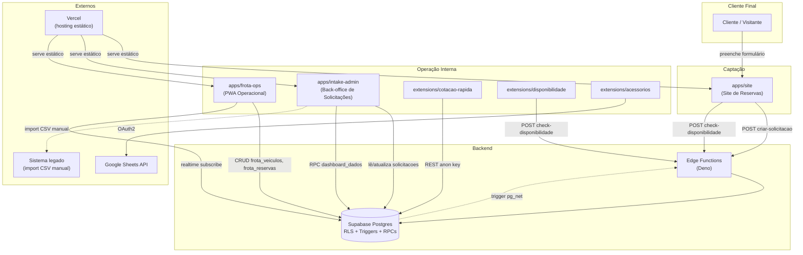

# Parte 1 — Visão Geral do Produto e Arquitetura Geral

## 1. Visão Geral do Produto

### 1.1 Qual problema o i-Frotas resolve

A Igufoz é uma locadora de veículos em Foz do Iguaçu. Antes deste sistema, a operação (controle de frota, reservas, disponibilidade) era manual/planilha, e a captação de clientes (site, cotação) era desconectada da operação real — ou seja, o vendedor cotava um carro sem saber com certeza se ele estaria disponível na data.

O ecossistema **i-Frotas** (nome interno usado pelo dono do produto para todo o conjunto) resolve isso unificando, num único banco de dados Supabase multi-tenant, duas pontas que antes eram desconexas:

1. **Captação** (cliente final): site público de reservas, onde o cliente solicita uma reserva.
2. **Operação** (equipe interna): painel de gestão de frota em tempo real (quais carros existem, onde estão, status, reservas confirmadas), mais extensões de navegador que aceleram tarefas repetitivas da central de atendimento.

### 1.2 Objetivo do projeto

Permitir que a central de reservas e a gerência:
- Vejam disponibilidade real de veículos por categoria e período, calculada a partir do estado real da frota (não uma contagem estática).
- Recebam e tratem solicitações de reserva vindas do site público, com fluxo de aprovação manual (`solicitada → em_analise → confirmada → concluida`, ou `cancelada` a qualquer momento intermediário).
- Operem a frota fisicamente (entrada/saída de veículo, pátio, lavador, manutenção) com rastreamento de auditoria automático.
- Cotem rapidamente para o cliente (por telefone/WhatsApp/balcão) usando extensões de navegador que buscam preço/disponibilidade direto do banco, sem precisar abrir o site ou perguntar para outra pessoa.

### 1.3 Dores operacionais que resolve

| Dor antes do sistema | Como o sistema resolve |
|---|---|
| Vendedor não sabe se o carro está realmente disponível | `check-disponibilidade` consulta `frota_veiculos` + `frota_reservas` em tempo real, considerando status físico do carro (limpo, no lavador, em manutenção) |
| Overbooking (vender 2x o mesmo carro) | Algoritmo de pool (ver Parte 8) decrementa o pool de veículos livres pelas reservas já confirmadas/previstas no período antes de informar disponibilidade |
| Categoria "fantasma" cadastrada errado trava disponibilidade real | Caso real documentado: GRUPO J tinha 1 veículo mas categorizado errado (`J - PREMIUM` em vez de `J`), o que zerava a disponibilidade aparente — corrigido nesta sessão (ver Parte 10, Dívida Técnica histórica) |
| Cotação feita "de cabeça", sem registro | Extensão "Cotação Rápida" consulta preço/categoria direto do Supabase e gera mensagem de WhatsApp pronta |
| Sem rastreabilidade de quem mexeu em quê na frota | `frota_movimentacoes` é populada automaticamente por trigger (`fn_log_frota_movimentacao`) sempre que status, pátio ou limpeza de um veículo muda |
| E-mail de admin "fantasma" sem caixa real, impossibilitando recuperação de senha | Corrigido nesta sessão: conta admin migrada para e-mail real do responsável (ver Parte 10) |

### 1.4 Processos automatizados

- Cálculo de disponibilidade por categoria e período (pool algorithm).
- Cálculo de preço (diária × dias, sazonalidade, proteção, adicionais).
- Numeração sequencial de solicitação por tenant (trigger).
- Transição de status de solicitação validada por banco (trigger impede pular etapas).
- Log de auditoria de movimentação de frota (trigger).
- Criação automática de perfil `usuarios` no signup do Supabase Auth (trigger `fn_criar_usuario_no_signup`).
- Notificação (atualmente desativada/stub — ver Parte 10) ao admin quando uma nova solicitação é criada, via trigger de banco + `pg_net` chamando uma Edge Function.

### 1.5 Processos que continuam manuais

- **Aprovação da solicitação**: ninguém confirma reserva automaticamente — um humano (admin/operador) muda o status em `apps/intake-admin`.
- **Atribuição de veículo físico (placa) à reserva**: `frota_reservas.placa_atribuida` é opcional e setado manualmente pela operação, não pelo algoritmo de disponibilidade (que trabalha com pool, não com veículo específico).
- **Sincronização entre o sistema "oficial" externo da locadora e `frota_reservas`**: existe uma aba de importação (CSV) no `apps/intake-admin` (ver `pages/reservas.js`/`admin.js` — funcionalidade de sync), mas é disparada manualmente pelo operador, não é um pipeline automático.
- **Cobrança e pagamento**: não existe nenhuma integração com gateway de pagamento em nenhum módulo. `valor_estimado` é só uma estimativa exibida/registrada — não há cobrança real no sistema.
- **Contratos físicos/digitais**: não há geração nem armazenamento de contrato de locação no sistema (apesar de `documentos` armazenar CNH/RG/passaporte do cliente, não armazena o contrato em si).
- **Notificação por e-mail**: atualmente um stub — ver Parte 10, item "Dívida Técnica".

### 1.6 Diferenciais

- **Multi-tenant desde o desenho do schema**: toda tabela de negócio tem `tenant_id`, RLS isola por tenant via `fn_meu_tenant_id()`/`fn_sou_admin()`. Hoje só existe 1 tenant ativo (`a1b2c3d4-0000-0000-0000-000000000001`, Igufoz), mas o sistema já está pronto para operar múltiplas locadoras isoladas no mesmo banco.
- **Algoritmo de disponibilidade por pool**, não por reserva-veículo fixa (ver ADR-003, Parte 10) — mais realista operacionalmente, pois reflete o estado físico real dos carros (limpeza, lavador, manutenção), não só "reservado/livre".
- **Extensões de navegador** como camada de produtividade da central de atendimento, sem precisar abrir o painel admin completo para uma cotação rápida.
- **JavaScript vanilla em todo o frontend** — decisão arquitetural deliberada (ADR-001), sem framework, sem build step, sem bundler.

### 1.7 Filosofia da arquitetura

O ecossistema segue, em teoria, um framework de governança formal documentado em `.claude/CLAUDE.md` (a "Constituição" do projeto, escrita pelo próprio dono do produto), que prega:

- Clareza antes de cleverness.
- Simplicidade deliberada.
- Separação de responsabilidades (camadas: Apresentação → Lógica de Negócio → Acesso a Dados → Banco de Dados).
- Segurança por design (RLS obrigatório, validação na borda).
- JavaScript vanilla, sem framework, sem build.
- Edge Functions stateless, lógica de negócio fora do SQL bruto (controverso — ver Parte 10: na prática, há lógica de negócio real dentro de `plpgsql` em vários triggers e RPCs, o que tecnicamente viola RB-04 do próprio framework).

Na prática (constatado nesta auditoria), a aderência ao framework é **parcial**: convenções de nomenclatura, estrutura de pastas e padrão RLS são seguidos consistentemente; já regras como "RD-01 JSDoc obrigatório" e "RB-04 sem lógica de negócio em SQL" não são seguidas à risca. Isso é detalhado na Parte 10 (Dívida Técnica) e Parte 12 (Autoavaliação).

---

## 2. Arquitetura Geral

### 2.1 Módulos existentes

| Módulo | Caminho | Tecnologia | Propósito |
|---|---|---|---|
| **Site de Reservas** | `apps/site/` | HTML/CSS/JS vanilla, ES Modules | Captação pública — cliente final monta uma solicitação de reserva |
| **Painel Admin (Intake)** | `apps/intake-admin/` | HTML/CSS/JS vanilla | Back-office que recebe e processa as `solicitacoes` vindas do site |
| **PWA Operacional (Frota Ops)** | `apps/frota-ops/` | HTML/CSS/JS vanilla, ES Modules, Service Worker | App instalável (PWA) para a operação: dashboard, veículos, reservas confirmadas, pátio, disponibilidade |
| **Extensão Cotação Rápida** | `extensions/cotacao-rapida/` | Chrome Extension Manifest V3 (content script + iframe sidebar) | Sidebar injetada em qualquer aba do navegador para cotar rapidamente categoria/preço/proteção/adicionais |
| **Extensão Disponibilidade (D.I.F)** | `extensions/disponibilidade/` | Chrome Extension Manifest V3 (mesma arquitetura da Cotação Rápida) | Sidebar para consultar disponibilidade de frota por categoria/período, sem abrir o painel completo |
| **Extensão Acessórios** | `extensions/acessorios/` | Chrome Extension Manifest V3 (popup clássico, **não convertida** ao padrão sidebar) | Controle de cadeirinhas/acessórios — **não usa Supabase**, usa Google Sheets API via OAuth |
| **Banco de Dados** | Supabase (projeto `lxfnqzuzohudqwibgdic`) | PostgreSQL 17 + RLS + pg_net | Fonte de verdade única de todo o ecossistema (exceto Acessórios) |
| **Edge Functions** | `supabase/functions/` | Deno (TypeScript) | Backend "sem servidor" — validação, regras que não podem rodar no cliente, orquestração |
| **Hospedagem (site/admin/frota-ops)** | Vercel | Static hosting + rewrites (`vercel.json`) | Serve os 3 apps HTML/JS estáticos sob o mesmo domínio, roteado por path |
| **Hospedagem (banco/Edge Functions)** | Supabase Cloud | — | Hospeda Postgres + Edge Functions + Auth + Storage |
| **Serviço externo (e-mail)** | Resend — **removido** | — | Antes enviava e-mail de notificação ao admin; removido por decisão do dono do produto (não gostou da plataforma); função `notificar-reserva` hoje é um stub que não envia nada |
| **Serviço externo (planilhas — Acessórios)** | Google Sheets API | OAuth2 | Única integração fora do Supabase; usada exclusivamente pela extensão Acessórios |
| **Sistema legado/externo "oficial"** | — (fora deste repo) | — | Sistema de gestão da locadora que já existia antes; `apps/intake-admin` tem uma função de importação CSV para sincronizar categorias/reservas vindas de lá para dentro de `frota_reservas`/`frota_veiculos` |

### 2.2 Responsabilidades, limites e dependências

### 2.3 Regras explícitas de comunicação

- **`apps/site` nunca acessa o banco diretamente para escrita** — toda criação de solicitação passa pela Edge Function `criar-solicitacao`, que valida, recalcula preço server-side e insere via RPC `inserir_solicitacao_completa`. Leitura de catálogo (categorias, proteções, adicionais, locais, sazonalidade) é feita direto via REST do Supabase com a chave anônima — protegida por RLS de "leitura pública apenas se `ativo=true`".
- **`apps/intake-admin` e `apps/frota-ops` acessam o banco diretamente** via `@supabase/supabase-js`, autenticados (login Supabase Auth), protegidos por RLS (`fn_sou_admin()`).
- **`extensions/cotacao-rapida` e `extensions/disponibilidade` usam a chave anônima** (publishable key) direto no `fetch()`, sem login — são ferramentas de produtividade que só leem dados públicos (categorias, preços) ou chamam a Edge Function pública `check-disponibilidade`.
- **`extensions/acessorios` nunca toca o Supabase** — é um sistema paralelo e isolado, falando só com Google Sheets.
- **Nenhum módulo de frontend (site, admin, frota-ops, extensões) deve conter a `SUPABASE_SERVICE_ROLE_KEY`** — essa chave só existe nas variáveis de ambiente das Edge Functions (verificado nesta auditoria: nenhuma ocorrência encontrada em código de frontend).
- **`apps/intake-admin` e `apps/frota-ops` nunca se chamam diretamente** — ambos só se comunicam indiretamente através do banco de dados compartilhado. Isso é deliberado: são dois bounded contexts diferentes (intake vs. operação), unidos só pelo dado (`solicitacoes` × `frota_reservas`), nunca por chamada direta de código.
