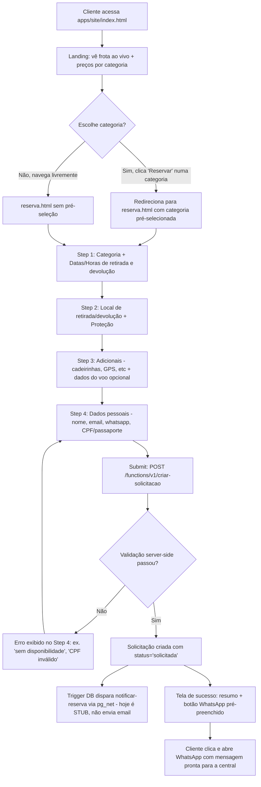
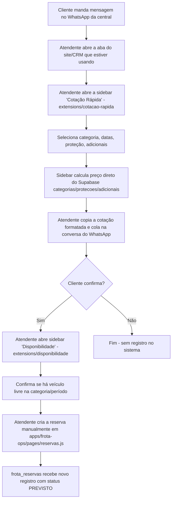
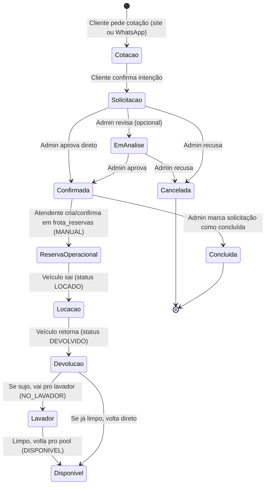
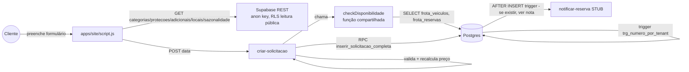
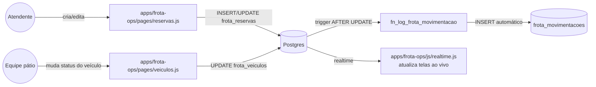
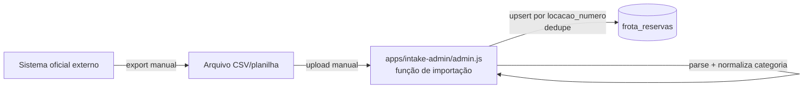

# Parte 2 — Fluxos do Sistema

## 3. Fluxo Completo do Usuário (Cliente Final)

O cliente tem dois caminhos de entrada possíveis hoje: **site** (fluxo completo, automatizado) e **WhatsApp** (fluxo manual, fora do sistema, mediado por um atendente usando as extensões).

### 3.1 Caminho A — Site (`apps/site`)

**Caminhos alternativos dentro do site:**
- Cliente pode abandonar em qualquer step — nada é salvo no banco até o submit final do Step 4 (rascunho fica só em `sessionStorage` do navegador, chave `SESSION_KEY` em `apps/site/script.js`, para não perder o que já preencheu se recarregar a página).
- Se `check-disponibilidade` (chamada em tempo real conforme o cliente escolhe categoria/datas) reportar `disponivel: 0` para uma categoria com frota cadastrada (`fonte: 'frota'`), o site bloqueia o avanço/submit com mensagem de indisponibilidade — mas se a categoria não tiver frota cadastrada (`fonte: 'sem_dados'`), o site **não bloqueia** (decisão deliberada: sistema de aprovação manual, não trava o cliente por falta de dado).
- Cliente estrangeiro: fluxo idêntico, mas em vez de CPF preenche `cliente_doc` (passaporte) e marca `estrangeiro: true`.

### 3.2 Caminho B — WhatsApp (mediado por atendente)

Esse caminho **não passa pelas tabelas `solicitacoes`/`solicitacao_itens`** (que são exclusivas do funil do site) — ele insere direto em `frota_reservas`, que é a tabela operacional da frota. Ou seja, existem **duas tabelas de "pedido"** no sistema, com propósitos diferentes (ver Parte 6, Fonte de Verdade):
- `solicitacoes` = pedido do funil de captação do site, com fluxo de aprovação.
- `frota_reservas` = reserva operacional real da frota, criada tanto manualmente (atendente) quanto — em teoria — a partir de uma solicitação aprovada (mas **não há automação que converta `solicitacoes` confirmada em `frota_reservas`** — isso hoje é manual, ver Parte 10, Dívida Técnica).

### 3.3 Ciclo de vida completo (cotação → devolução)

---

## 4. Fluxo Operacional Interno

### 4.1 Central de Reservas (atendente / vendedor)

**Telas/ferramentas usadas, em ordem típica de uso num atendimento:**
1. `extensions/cotacao-rapida` — sidebar aberta em qualquer aba, usada o tempo todo para responder "quanto custa" rapidamente.
2. `extensions/disponibilidade` — sidebar aberta sob demanda, para confirmar "tem carro" antes de fechar negócio.
3. `apps/intake-admin` (aba `Reservas`, `pages/reservas.js`) — para ver e dar andamento nas `solicitacoes` que vieram do site.
4. `apps/frota-ops` (aba `Reservas`, `pages/reservas.js`) — para criar/editar reservas operacionais reais (`frota_reservas`), atribuir placa.

**Sequência operacional típica de um dia:**
1. Abre `apps/intake-admin`, filtra solicitações com `status='solicitada'`.
2. Para cada uma, decide: aprovar direto (`confirmada`) ou pedir mais informação (`em_analise`) ou recusar (`cancelada`, com motivo obrigatório).
3. Para as aprovadas, vai em `apps/frota-ops` e cria/confirma a reserva operacional correspondente em `frota_reservas` (passo manual, sem automação hoje).
4. Ao longo do dia, responde clientes via WhatsApp usando as extensões de cotação/disponibilidade.

### 4.2 Equipe Operacional (pátio / movimentação física)

**Telas usadas:** exclusivamente `apps/frota-ops`:
- `pages/patio.js` — controle de qual veículo está em qual pátio.
- `pages/veiculo-detalhe.js` — visão de um veículo específico (placa, status, histórico de movimentações).
- `pages/veiculos.js` — listagem geral da frota.

**Informações manipuladas:** `frota_veiculos.status` (`DISPONIVEL` / `LOCADO` / `DEVOLVIDO` / `NO_LAVADOR` / `MANUTENCAO`), `limpo` (boolean), `patio_atual`, `hora_entrada_lavador`, `prev_retorno`. Toda mudança nesses campos dispara o trigger `fn_log_frota_movimentacao`, que grava automaticamente em `frota_movimentacoes` — a equipe **não precisa preencher nada manualmente para o log de auditoria**, ele é derivado.

### 4.3 Administrador (gestão de cadastro)

**Telas usadas:** `apps/intake-admin`, abas `Categorias`, `Proteções`, `Adicionais`, `Locais`, `Sazonalidade`, `Clientes`, `Auditoria`.

**Sequência típica:** cadastro/edição de preço de categoria, configuração de tarifa sazonal (`sazonalidade.precos`, um JSON por categoria/slug), gestão de proteções e seus preços, gestão de locais de retirada/devolução (e suas janelas de horário permitidas).

### 4.4 Gestor (visão executiva)

**Telas usadas:** `apps/intake-admin` aba `Dashboard` (`pages/dashboard.js`, consome a RPC `dashboard_dados`) e `apps/frota-ops` aba `Dashboard` (`pages/dashboard.js` — dashboard operacional, com KPIs de frota, não de solicitações).

**Informações manipuladas:** somente leitura — KPIs (total de reservas, confirmadas, em análise, canceladas, faturamento estimado), gráficos por categoria/proteção/adicional, lista de reservas recentes.

---

## 5. Fluxo de Dados

### 5.1 Funil de captação (site → solicitação)

**Origem → Transformação → Destino:**

| Dado | Origem | Transformação | Destino |
|---|---|---|---|
| Categoria/preço/proteção/adicional escolhidos | Cliente no formulário | Nenhuma no cliente — preço **é recalculado do zero no servidor**, o valor mostrado no site é só estimativa visual | `solicitacoes.valor_estimado`, `solicitacao_itens` |
| CPF | Cliente digita | Validado por checksum (`validarCPF`) na Edge Function | `solicitacoes.cliente_cpf` |
| Data/hora retirada e devolução | Cliente escolhe em inputs separados (data + hora) | Concatenados em ISO 8601 (`${data}T${hora}:00`) no cliente antes de enviar | `solicitacoes.data_retirada`/`data_devolucao` |
| Disponibilidade | `frota_veiculos` + `frota_reservas` | Algoritmo de pool (Parte 8) | Resposta JSON ao cliente (não persistida — é calculada on-the-fly a cada consulta) |

### 5.2 Funil operacional (reserva → movimentação física)

### 5.3 Importação/sincronização com sistema legado (planilha → banco)

Ver Parte 8 (seção 13) para o detalhamento completo desse processo, incluindo as regras de normalização de categoria e tratamento de duplicidade.
