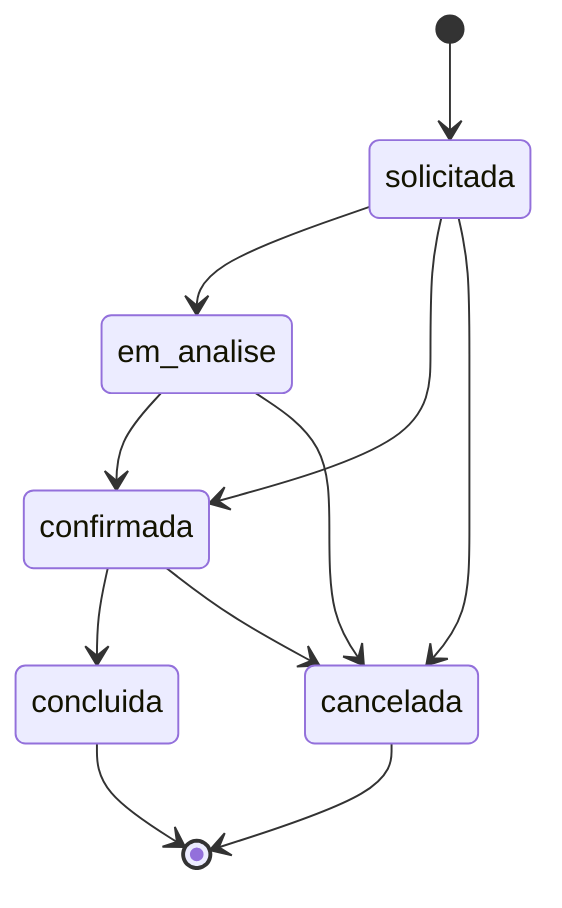

# Parte 5 — Regras de Negócio

Cada regra abaixo indica **onde está implementada** (arquivo + função), para que o próximo desenvolvedor não precise procurar.

## 5.1 Cálculo de Disponibilidade (algoritmo de pool)

**Implementado em**: `supabase/functions/_shared/disponibilidade.ts`, função `checkDisponibilidade()`. Espelhado (versão JS independente, **duplicação de lógica**, ver Parte 10) em `apps/frota-ops/js/utils.js`, função `calcularDisponibilidade()`.

**Regra**: para uma categoria e período (`dataSaida` → `dataRetorno`):
1. Busca todos os veículos de `frota_veiculos` daquela categoria/tenant.
2. Se não há nenhum veículo cadastrado → retorna `{ disponivel: null, fonte: 'sem_dados' }` (estado "não sei", distinto de "zero disponível").
3. Busca todas as `frota_reservas` da mesma categoria/tenant com `status IN ('PREVISTO','CONFIRMADO')` cujo intervalo **se sobrepõe** ao período pedido (`r.data_saida < dataRetorno AND r.data_retorno_prev > dataSaida`).
4. Reservas com `placa_atribuida` preenchida removem aquela placa específica do pool.
5. Reservas **sem** `placa_atribuida` contam como "ocupação genérica" — decrementam o pool no fim, não removem uma placa específica.
6. Para cada veículo restante no pool, aplica regras de status físico:
   - `LOCADO`: só entra no pool se `prev_retorno` existir, for **antes** do início pedido, **e** `calcularDisponivel(prev_retorno)` (ver regra de buffer abaixo) também for antes do início pedido.
   - `DEVOLVIDO` e `!limpo`: **excluído** do pool (carro sujo não é oferecido).
   - `NO_LAVADOR`: só entra se `calcularSaidaLavador(hora_entrada_lavador) <= dataSaida` (ver regra de buffer do lavador).
   - `MANUTENCAO`: sempre excluído.
   - Qualquer outro status (ex. `DISPONIVEL`): entra direto.
7. `disponivel = max(0, poolDisponivel.length - reservasSemAtribuicaoNoPeriodo)`.

**Por que pool e não contagem simples**: decisão documentada em `docs/adr/ADR-003-algoritmo-disponibilidade-por-pool.md`. Antes da versão atual (commit `069d03e`), o cálculo era uma contagem simples de reservas vs. frota total, que gerava overbooking porque não considerava o estado físico real de cada carro (sujo, no lavador, em manutenção).

## 5.2 Buffer de liberação pós-devolução (`calcularDisponivel`)

**Implementado em**: `_shared/disponibilidade.ts`, função `calcularDisponivel(retorno: Date)`.

| Hora de retorno previsto | Quando o carro fica "disponível" de novo |
|---|---|
| Domingo, qualquer hora | Segunda-feira seguinte, 12h |
| Antes das 12h | Mesmo dia, 16h |
| Entre 12h e 14h | Dia seguinte, 8h |
| Depois das 14h | Dia seguinte, 10h |
| (resultado cair num domingo) | Empurra para segunda, 12h |

Essa é uma regra de negócio puramente operacional (tempo de limpeza/preparação do carro) — **hardcoded em código**, sem tabela de configuração. Se a locadora quiser mudar esses horários, é deploy de Edge Function, não uma tela de admin.

## 5.3 Buffer do lavador (`calcularSaidaLavador`)

**Implementado em**: `_shared/disponibilidade.ts`. Regra fixa: carro sai do lavador **3 horas** após `hora_entrada_lavador`. Também hardcoded, sem configuração via UI.

## 5.4 Cálculo de diárias (`calcDias`)

**Implementado em**: `supabase/functions/criar-solicitacao/index.ts`, função `calcDias(ret, dev)`.

```
diffH = horas entre retirada e devolução
full  = floor(diffH / 24)
resto = diffH % 24

se resto <= 1h  → cobra full dias (arredonda pra baixo, tolerância de 1h de atraso sem cobrar diária extra)
se resto > 4h   → cobra full + 1 dia inteiro
senão (1h < resto <= 4h) → cobra full + fração (resto*2/8 — ou seja, incrementos de 0.25 dia a cada 30min de tolerância)
```

Essa é uma regra de **hora extra/tolerância** de devolução — existe uma versão espelhada em `apps/site/script.js`, função `calcDias()` (usada só para **exibir estimativa** ao cliente durante o preenchimento; o valor cobrado de fato vem sempre do recálculo server-side em `criar-solicitacao`).

## 5.5 Cálculo de preço final da solicitação

**Implementado em**: `supabase/functions/criar-solicitacao/index.ts`, dentro do handler principal.

```
precoCat = categorias.preco_diaria
SE existe sazonalidade ativa cobrindo a data de retirada E tem preço pro slug da categoria:
    precoCat = sazonalidade.precos[slug]

baseCat  = precoCat * dias
baseProt = protecao.tipo_preco == 'per_day' ? protecao.preco * dias : protecao.preco
totalAdd = soma de (adicional.tipo_preco == 'per_day' ? preco*qty*dias : preco*qty) para cada item

valor_estimado = round((baseCat + baseProt + totalAdd) * 100) / 100
```

**Importante**: o preço mostrado no site durante o preenchimento (`apps/site/script.js`, `getPreco()`/`calcSubtotal()`) é **só uma prévia visual** — o valor que efetivamente vai pro banco é sempre recalculado do zero no servidor, usando os preços atuais do catálogo no momento do submit, não o que o cliente "viu" na tela (proteção contra manipulação client-side e contra preço desatualizado em cache do navegador).

## 5.6 Categorias / Slug Map

**Implementado em**: `supabase/functions/_shared/disponibilidade.ts`, constante `SLUG_MAP`.

```
grupo_b → B
grupo_c → C
grupo_d → D+
grupo_e → E
grupo_f → F
grupo_g → G
grupo_h → H
grupo_i → I
grupo_j → J
grupo_u → 'U - UTILITARIO'
```

Esse mapa traduz o `slug` público da categoria (usado pelo site/extensões) para o texto livre armazenado em `frota_veiculos.categoria`/`frota_reservas.categoria`. **Regra frágil** (ver Parte 10): qualquer divergência de grafia entre este mapa e o texto real cadastrado na frota quebra silenciosamente a disponibilidade daquela categoria (caso real corrigido nesta sessão: GRUPO J).

**Atualização**: a categoria J-PREMIUM foi eliminada do sistema (mesclada em "J") por decisão do dono do produto — não existe mais distinção entre as duas. `grupo_j_premium` foi removida do `SLUG_MAP`. U-UTILITARIO permanece como categoria distinta, com a mesma fragilidade de grafia ainda não corrigida (ver Parte 10, item 4).

## 5.7 Upgrade de categoria

**Não implementado.** Não há nenhuma lógica de upgrade automático de categoria (ex.: oferecer categoria superior se a pedida estiver indisponível) em nenhum dos módulos auditados. Se quiser oferecer upgrade, é decisão manual do atendente.

## 5.8 Overbooking

**Prevenção implementada em**: o próprio algoritmo de pool (5.1) — ao consultar disponibilidade antes de criar a solicitação (`criar-solicitacao` chama `checkDisponibilidade` antes de inserir), e ao bloquear a criação se `fonte === 'frota' && disponivel === 0` (HTTP 409).

**Limitação conhecida (condição de corrida)**: entre o momento em que `criar-solicitacao` verifica disponibilidade e o momento em que de fato insere a solicitação, **não há lock nem reserva otimista** — duas requisições simultâneas para a última vaga da mesma categoria podem ambas passar na checagem e ambas inserirem. Isso é aceitável no desenho atual porque `solicitacoes` é um *pedido*, não uma reserva confirmada (a confirmação real em `frota_reservas` é manual, dando à operação a chance de pegar esse conflito humanamente) — mas é uma race condition real que **não está documentada em lugar nenhum do código**, só constatada nesta auditoria.

## 5.9 Bloqueios e restrições por local

**Implementado em**: tabela `locais` — `permite_retirada`/`permite_devolucao` (boolean), janelas de horário (`hora_retirada_inicio/fim`, `hora_devolucao_inicio/fim`), `disponivel_domingo`. **Validação dessas regras no submit não foi localizada na Edge Function `criar-solicitacao`** — os campos existem na tabela e presumivelmente são usados para filtrar as opções mostradas no formulário do site (client-side), mas a Edge Function não valida server-side se o horário escolhido respeita a janela do local. Isso é uma lacuna de validação na borda (RB-02) — ver Parte 9.

## 5.10 Cancelamentos

**Implementado em**: trigger `fn_validar_transicao_status()` (tabela `solicitacoes`). Regra: `motivo_cancelamento` é **obrigatório** (não nulo, não vazio após trim) sempre que `status` muda para `cancelada`. Estados finais (`concluida`, `cancelada`) são **imutáveis** — qualquer tentativa de UPDATE numa solicitação nesses estados é rejeitada com exceção SQL.

## 5.11 Transições de status permitidas (máquina de estados)

**Implementado em**: mesma trigger function acima.



Qualquer transição fora desse grafo (ex. `concluida → solicitada`, ou pular de `solicitada` direto sem passar por nada — espera, `solicitada → confirmada` é permitido diretamente, ver ADR-005) gera exceção e a UPDATE falha inteira (rollback).

## 5.12 Alterações de reserva já confirmada

**Não há regra de negócio explícita** sobre o que acontece se o cliente quiser mudar data/categoria de uma solicitação já `confirmada`. Não existe endpoint de "editar solicitação" — na prática, a operação provavelmente cancela e cria uma nova (fora do escopo automatizado do sistema).

## 5.13 Regras de validação de entrada (borda do sistema)

**Implementado em**: `supabase/functions/criar-solicitacao/index.ts`.

| Campo | Regra | Função |
|---|---|---|
| `tenant_id`, `categoria_id` | Formato UUID v4 (regex) | inline |
| `cliente_email` | Regex simples de formato de e-mail | `validarEmail()` |
| `cliente_whatsapp` | 10 a 13 dígitos após remover não-dígitos | `validarWhatsApp()` |
| `cliente_cpf` | Checksum de CPF (algoritmo padrão de 2 dígitos verificadores) — só validado se **não** for estrangeiro | `validarCPF()` |
| `pessoas` | Entre 1 e 20 | inline |
| `data_retirada`/`data_devolucao` | Datas parseáveis, devolução após retirada (`calcDias > 0`) | inline |

## 5.14 Regra de acessórios/cadeirinhas (catálogo Supabase)

**Implementado em**: tabela `adicionais`, flag `is_cadeirinha`. `categorias.max_cadeirinhas` limita quantas cadeirinhas uma categoria de veículo comporta — **não há validação server-side encontrada** que impeça o cliente de pedir mais cadeirinhas do que `max_cadeirinhas` permite. É outra lacuna de validação (ver Parte 9).

## 5.15 Regra de acessórios (extensão paralela, Google Sheets)

**Implementado em**: `extensions/acessorios/` (popup.js/background.js), fora do Supabase inteiramente. Não documentado neste handoff em detalhe algorítmico porque **não foi auditado a fundo nesta sessão** (fora do escopo das correções realizadas) — próximo desenvolvedor deve tratar como "caixa preta legada" até investigação dedicada. Achado relevante: essa extensão representa uma **fonte de verdade duplicada e desconectada** do catálogo `adicionais`/`is_cadeirinha` do Postgres (ver Parte 6 e Parte 10).

## 5.16 Prioridade de exibição (categorias, locais, etc.)

**Implementado em**: campo `ordem` (integer) em `categorias`, `protecoes`, `adicionais`, `locais`, `frota_patios` — convenção simples de ordenação manual ascendente, sem lógica adicional.

## 5.17 Filtros de disponibilidade por ponto de retirada

`frota_veiculos.ponto_retirada`/`ponto_retorno` e `frota_reservas.ponto_retirada`/`ponto_retorno` existem como colunas, mas **`checkDisponibilidade()` não filtra por ponto** — a disponibilidade calculada é por categoria+período apenas, ignorando location. Ou seja, o sistema pode dizer "tem carro disponível" sem garantir que ele está fisicamente no local que o cliente escolheu. Lacuna funcional real (ver Parte 9/10).
