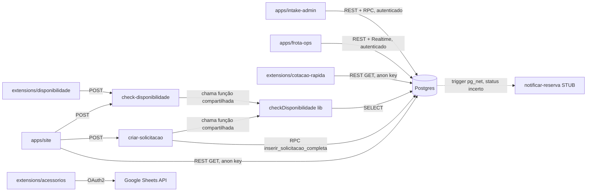

# Parte 6 — Arquitetura Técnica e Comunicação entre Módulos

## 10. Arquitetura Técnica

### 10.1 Stack completa

| Camada | Tecnologia | Versão/detalhe |
|---|---|---|
| Frontend (todos os apps) | HTML + CSS + JavaScript vanilla | Sem framework (ADR-001) |
| Módulos JS | ES Modules nativos (`import`/`export`) | Sem bundler, sem transpilação, sem build step |
| Cliente Supabase | `@supabase/supabase-js` | `^2.108.2`, carregado via CDN (`esm.sh`) em `apps/site`/`apps/intake-admin`, via import map em `apps/frota-ops` (inconsistência de estratégia, ver Parte 10) |
| Backend | Supabase Edge Functions | Deno runtime, TypeScript |
| Banco | PostgreSQL | versão 17 (gerenciado pelo Supabase) |
| Autenticação | Supabase Auth | E-mail/senha, PKCE flow (commit `b5cf19d` corrigiu recuperação de senha pra usar `onAuthStateChange` com PKCE v2) |
| Realtime | Supabase Realtime | Usado em `apps/frota-ops/js/realtime.js` para atualizar telas ao vivo (dashboard, pátio) |
| PWA | Service Worker nativo (`apps/frota-ops/sw.js`) | Cache-first para assets estáticos, sem framework de PWA (Workbox etc.) |
| Extensões | Chrome Extension Manifest V3 | `cotacao-rapida` e `disponibilidade`: content script + iframe sidebar; `acessorios`: popup clássico (arquitetura antiga, não convertida) |
| Hospedagem estática | Vercel | Roteamento via `vercel.json` (rewrites por path) |
| Hospedagem backend | Supabase Cloud | Projeto `lxfnqzuzohudqwibgdic`, região `us-west-2` |
| E-mail | **Nenhum** (Resend removido) | `notificar-reserva` é um stub |
| Planilhas (só Acessórios) | Google Sheets API v4 | OAuth2, `client_id` em `extensions/acessorios/manifest.json` |
| Geração de imagem (PWA icons) | .NET `System.Drawing` via PowerShell | Usado pontualmente nesta sessão para gerar ícones — não é parte do pipeline normal do projeto |

### 10.2 Frameworks e bibliotecas

**Não há frameworks de UI** (React/Vue/Svelte/Angular) em nenhum módulo — decisão arquitetural deliberada e documentada (ADR-001), com a justificativa de simplicidade e ausência de build step.

**Dependências declaradas em `package.json`** (raiz do monorepo):
```json
{
  "dependencies": {
    "@supabase/supabase-js": "^2.108.2"
  }
}
```
(`docx` foi removida nesta sessão por estar sem uso em todo o código.)

**Observação**: o `package.json` único na raiz não reflete de fato um *workspace* multi-pacote (não há `workspaces` configurado) — é mais um manifesto de dependência compartilhada entre todos os apps, que importam `@supabase/supabase-js` via CDN de qualquer forma (não via `node_modules` em runtime no browser). O `package.json`/`node_modules` parecem existir principalmente para suprir o ambiente de desenvolvimento local (ex. rodar `npx serve`).

### 10.3 Estrutura de diretórios (visão arquitetural)

```
Fase 1/                            (raiz do monorepo, repo GitHub fase1site)
├── .claude/                       Framework de governança (CLAUDE.md, skills, checklists, etc.)
├── apps/
│   ├── site/                      Captação pública
│   ├── intake-admin/              Back-office de solicitações
│   └── frota-ops/                 PWA operacional
├── extensions/
│   ├── cotacao-rapida/
│   ├── disponibilidade/
│   └── acessorios/
├── supabase/
│   └── functions/
│       ├── _shared/               Código compartilhado entre Edge Functions
│       ├── check-disponibilidade/
│       ├── criar-solicitacao/
│       └── notificar-reserva/
├── sql/                           Migrations numeradas (001-021) + seed.sql + all_migrations.sql
├── docs/
│   ├── adr/                       Architecture Decision Records
│   ├── governance/                Documentos legíveis de governança
│   └── handoff-tecnico/           Este documento
├── package.json, vercel.json, .gitignore
└── serve-admin.cmd, serve-site.cmd (scripts de desenvolvimento local)
```

### 10.4 Padrões utilizados

- **Module pattern via ES Modules**: cada "página" do admin/frota-ops é um módulo que exporta `render*()` (HTML) e `bind*()` (event listeners), importado e roteado por um `app.js`/`admin.js` central com roteamento via hash (`#/pagina`).
- **Padrão sidebar-injetada para extensões** (`cotacao-rapida`, `disponibilidade`): `content.js` injeta um `<iframe>` apontando para `sidebar.html` (página interna da extensão) + um botão `<button>` de toggle, ambos via `document.body.appendChild`. Comunicação entre `content.js` (contexto da página) e o iframe (contexto da extensão) via `postMessage`. Estado de aberto/fechado persistido em `chrome.storage.local`.
- **Camada `_shared/` nas Edge Functions**: lógica reutilizável (`checkDisponibilidade`, helpers de resposta HTTP `errJson`/`okJson`) extraída para módulos importados por múltiplas functions — mas com uma limitação real: **cada deploy de Edge Function precisa reenviar o conteúdo de `_shared/` junto** (não há um mecanismo de "biblioteca compartilhada" no deploy via MCP usado nesta sessão — os arquivos `_shared/*.ts` são duplicados em cada payload de deploy). Documentado em ADR-004.
- **RPC transacional para escritas compostas**: `inserir_solicitacao_completa` garante atomicidade de "solicitação + itens" via `plpgsql` `SECURITY DEFINER`, evitando que a Edge Function precise orquestrar duas escritas com risco de inconsistência parcial.
- **Trigger-driven side effects**: timestamps, log de auditoria de frota, numeração sequencial e validação de máquina de estados são todos implementados como triggers de banco, não como lógica de aplicação — escolha que centraliza a regra (não importa por onde a escrita chegue, a regra vale), mas que **viola RB-04 do próprio CLAUDE.md** ("sem lógica de negócio em SQL") — contradição entre a governança formal e a prática real (ver Parte 10/12).

### 10.5 Build, Deploy, CI/CD, Versionamento, Branches

- **Build**: não existe. Os apps são HTML/CSS/JS servidos como estão, sem etapa de compilação/bundling/minificação.
- **Deploy (frontend)**: Vercel, deploy automático presumivelmente atrelado a push no branch `main` do GitHub (não foi encontrado nenhum arquivo de configuração de deploy adicional além de `vercel.json` — a integração GitHub↔Vercel é configurada no próprio dashboard da Vercel, fora do repositório).
- **Deploy (backend)**: Edge Functions são deployadas manualmente via MCP do Supabase (`deploy_edge_function`) ou via Supabase CLI — **não há pipeline de CI/CD automatizado** (`.github/workflows/` não existe no repositório, confirmado nesta auditoria).
- **Migrations**: aplicadas manualmente, uma a uma, via MCP `apply_migration` ou Supabase CLI — não há ferramenta de migração automática rodando em pipeline.
- **Versionamento**: Git, repositório único (monorepo desde a reorganização desta sessão). Convenção de commit: Conventional Commits (`feat:`, `fix:`, `chore:`, `docs:`, `refactor:`) — seguida consistentemente no histórico observado.
- **Branches**: o histórico mostra **trabalho direto em `main`**, sem branches de feature visíveis nos commits — RO-08 do CLAUDE.md ("branches main/production protegidas, pushes diretos bloqueados") **não está em vigor na prática** (não há configuração de branch protection visível/auditável a partir do repositório local).

---

## 11. Comunicação entre Módulos

### 11.1 Quem chama quem



### 11.2 Quem depende de quem

| Módulo | Depende de | Não deve nunca depender de |
|---|---|---|
| `apps/site` | Edge Functions (`criar-solicitacao`, `check-disponibilidade`), REST público do Postgres | `apps/intake-admin`, `apps/frota-ops` diretamente |
| `apps/intake-admin` | Postgres direto (autenticado), RPC `dashboard_dados` | `apps/frota-ops` diretamente |
| `apps/frota-ops` | Postgres direto (autenticado + Realtime) | `apps/intake-admin`, `apps/site` diretamente |
| `extensions/cotacao-rapida` | REST público do Postgres | qualquer módulo de aplicação |
| `extensions/disponibilidade` | Edge Function `check-disponibilidade` | qualquer módulo de aplicação |
| `extensions/acessorios` | Google Sheets API exclusivamente | Postgres/Supabase — **isolamento total e deliberado** |
| Edge Functions | Postgres via `service_role` (bypassa RLS) | nenhum frontend deve ter a `service_role` key |

### 11.3 Quem atualiza quem

Nenhum módulo de frontend "atualiza" outro diretamente — toda comunicação indireta passa pelo banco de dados como meio. A única "atualização em tempo real" entre sessões de usuários diferentes é via Supabase **Realtime**, usada em `apps/frota-ops` (`js/realtime.js`) para refletir mudanças de `frota_veiculos`/`frota_reservas` feitas por outro usuário, sem precisar dar refresh manual.

### 11.4 Quem consulta quem

Resumido na tabela 11.2 — adicionalmente: `apps/intake-admin` e `apps/frota-ops` **nunca se consultam entre si**, mesmo conceitualmente lidando com o mesmo cliente/reserva em momentos diferentes do funil. Essa é uma fronteira deliberada de bounded context (Parte 2, nota 3.2), mas também é uma lacuna funcional real: não há um link de volta de `frota_reservas` para a `solicitacoes` que a originou (não existe FK entre as duas tabelas) — ver Parte 10.

### 11.5 Quem nunca deve acessar outro módulo diretamente

- `extensions/acessorios` nunca deve ganhar acesso ao Supabase (mistura dois sistemas de fonte de verdade).
- Nenhum frontend deve importar/chamar código de outro app (`apps/site` não deve importar nada de `apps/intake-admin`, e vice-versa) — confirmado nesta auditoria: não há nenhuma referência cruzada de import entre os três apps.
- A `SUPABASE_SERVICE_ROLE_KEY` nunca deve sair do ambiente das Edge Functions — confirmado: nenhuma ocorrência em código de frontend ou de extensão.
